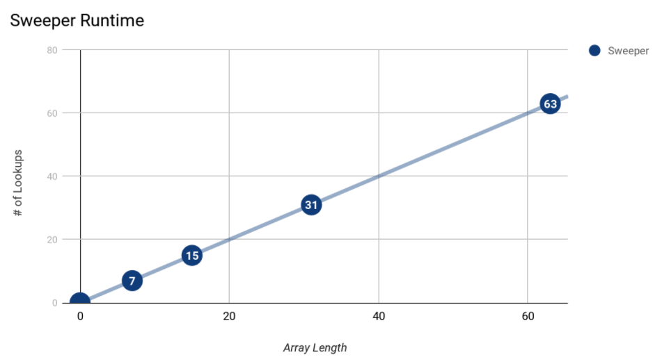
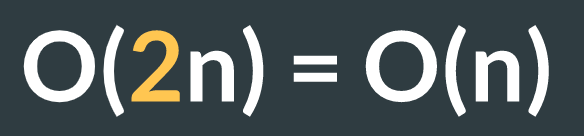
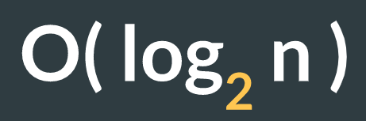

What are algorithms?

Operations we can perform on data structures + the sets of instructions for executing them

## Binary search

_"Finding something is just one step in a bigger problem The faster we can find what we're looking for, the faster our program will be."_

When talking about an algorithm's run time, we typically focus on the worst case.

For an array of length 7, a sweeper algorithm takes 7 lookups.

**This means its runtime is linear**

_Big O of n_

### O(n)

### Big O

Additional lookups are neglible on the overall runtime. The general consesus is that the sweeper algorithm has a Big O of n.

### Splitter

Only works when the array has already been sorted.

