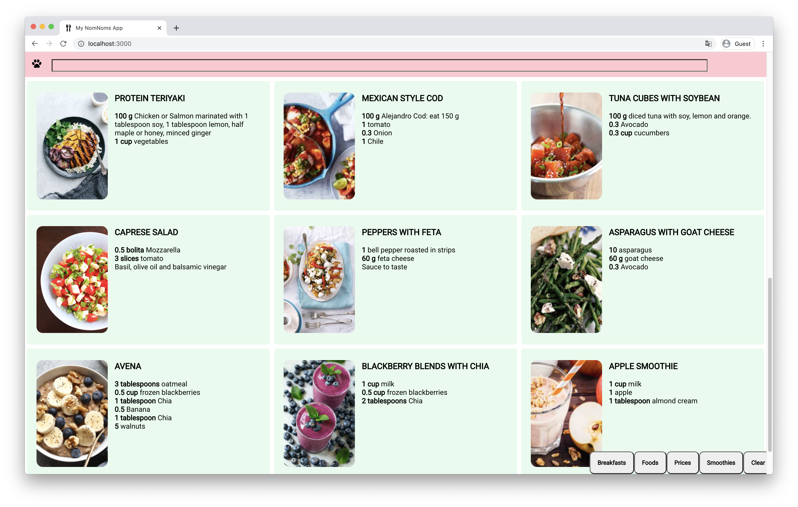

# Project Purpose and Goal

I wanted to develop an application that would help me **keep on course with healthy eating habits**. A few months back, my nutritionist made a meal plan for me and emailed a PDF. The process of opening my email, finding her pdf, waiting for it to load, and finally scrolling through what I wanted, was getting very tedious. **I wanted to make something fun and easy to use.**

My goal was to **make it simple** so that I could glance at the meal and know the portion sizes. I also wanted a quick filter that would show breakfast, lunch and dinner.

# Web Stack and Explanation

This was my first application from scratch using **React**. Looking back, I think I could've achieved the same results using vanilla javascript but at the time **I wanted to understand React as much as possible.**

I wanted to challenge myself to go a step further from the course's requirements. I wanted to learn more about **Progressive Web Apps** and wanted to implement it in my code.

For deployment I chose Netlify because it integrates seamlessly with github. Anytime I push new changes to the repository, Netlify runs my scripts and builds the website.

# Problems and Thought Process

It took me some time to adapt my thinking to the way React works but after the first few days I was comfortable with it. **My biggest problem was understanding states and passing them between components**. I eventually realized that most of my problems could've been solved with a state store such as Redux, but I got good results from **passing callbacks between components.**

Deploying the PWA was easier than I thought because it does most of the heavy-lifting for you out of the box if you use create-react-app. The rest was testing it on different devices and **making sure there were no cross-platform issues.**

Finally, I wanted to make the **site as fast as possible and unfortunately my images were the bottleneck** of the application. Since I wanted it to load fast and be responsive, I opted for an image **cloud resizing application**. I chose [cloudimage.io](https://www.cloudimage.io/en/home) because it is free and they have easy to use tools. I loved their documentation.

# Future work

**I want to refactor the code and make it as clean as possible**. I would like to add a backend and user authentication so that other people can use it. I think that going back to my old code will be a reminder of where I started and where I am at right now.
