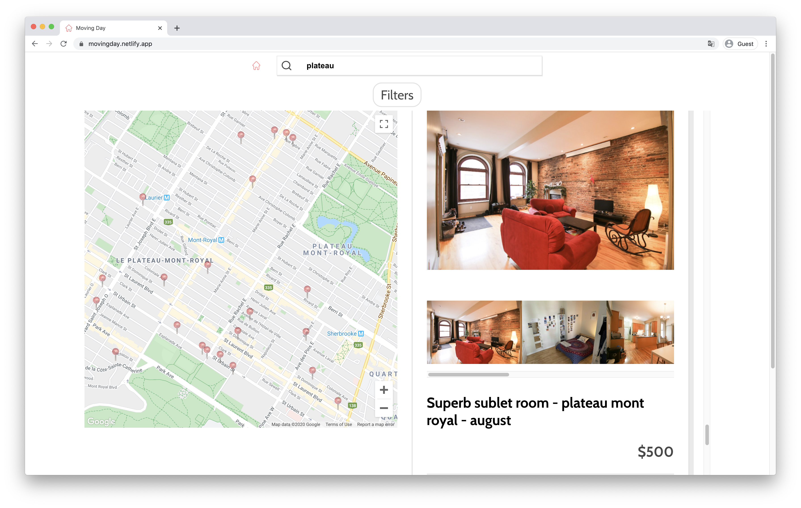

# Project Purpose and Goal

The CEO’s main concern was the speed of the original site. It was usually taking about 8-12 seconds to show the content. This meant that any social media campaign would likely fail, as users would leave the site before it even loaded. **As google puts it “Two seconds is the threshold for ecommerce website acceptability. At Google, we aim for under a half-second.”** Once that was agreed upon, I set my goal to prioritize speed.

# Problems and Thought Process

The biggest challenge for this project was that it had image heavy pages that had to load as fast as possible. I looked through the original site to determine what could be optimized and what had to be re-built. **I quickly realized that most of the loading time was spent on unused scripts and large images.** I went through the code to lazy load images, but it didn’t make much of a difference. The scripts were the issue. **The second problem was that all the media was being requested on demand from the server,** which added an additional delay to the page's load-time.

I quickly came to the conclusion that optimizing the current site was going to take longer than building it from scratch. **I put together a test that reproduced the landing page's functionality but based on a static page model instead of a dynamic one**. The results were immediately noticeable.

<iframe src="https://player.vimeo.com/video/471748874" width="640" height="360" frameborder="0" allow="autoplay; fullscreen" allowfullscreen></iframe>
*Here is an early test of the old website and my Gatsby version.*

After my proof of concept, I was told to go ahead and rebuild the whole site's frontend. **After the users coming from social media interacted with the experience, they would move on to completing the conversion that was running on legacy backend** for the first stage of the product's launch. Later we would be able to move it to Shopify seamlessly because the frontend wouldn't change.

# Web Stack and Explanation

I used Gatsby as my static page generator to ensure that the pages would load as fast as possible. I also chose this technology because it’s based on React, this gave me flexibility to use components that I had been working on previously. **I built a markdown based content management system for the team to add and modify content easily.** I deployed it to Netlify because it offers an open source CMS and admin solutions out of the box. Finally, I implemented Stripe for payments using their Nodejs API. **Since I wanted to avoid deploying a server, I added a serverless lambda function that talked to the Stripe API.**

<iframe src="https://player.vimeo.com/video/471747159" width="640" height="353" frameborder="0" allow="autoplay; fullscreen" allowfullscreen></iframe>

_Initial speed tests of the static site using GatsbyJS and its image optimization API._

# Lessons Learned & Future Work

**The approach we took for this project was setting small goals, building minimum viable products and comparing those to the ones in production.** This led to a fast paced process that yielded well performing results. **Having the opportunity to build from scratch and learn from the company's previous mistakes gave me a huge lead.**
